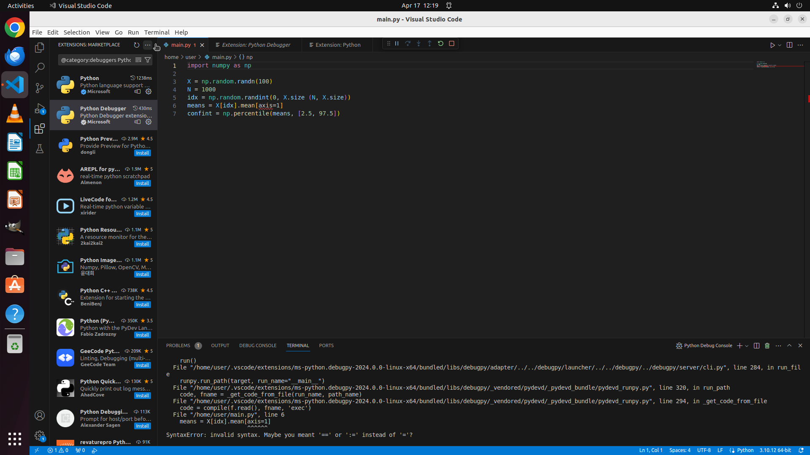
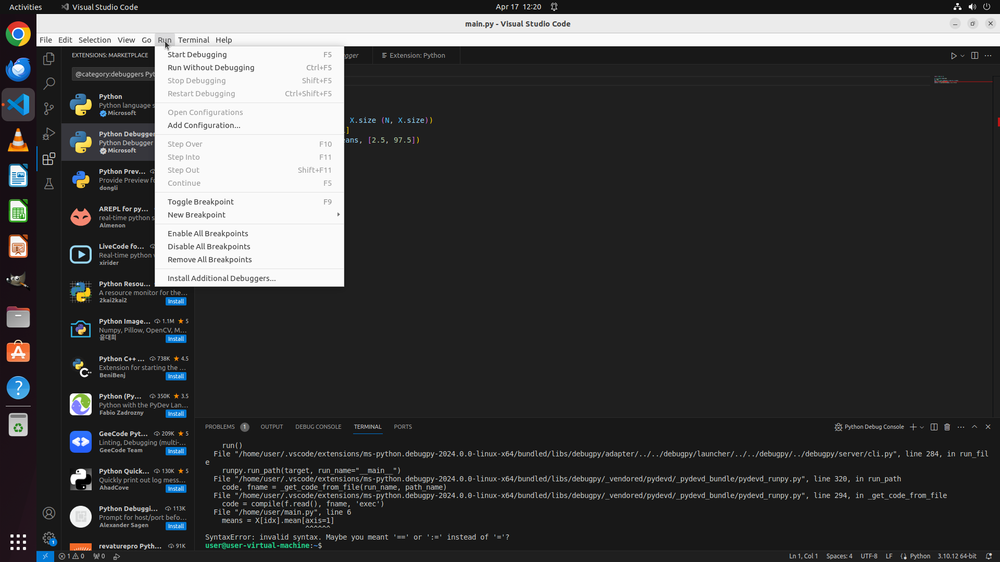

# Architecture

How CUA-WM turns one frozen OpenCUA-7B into a policy *and* a world model, and what each
of the five steps actually does. Code references point at
[`world_modeling/core/`](../world_modeling/core/).

## The problem being solved

A computer-use agent sees a screenshot and emits an action. OpenCUA-7B does this in one
shot: screenshot in, `pyautogui` code out. When it is wrong, it is wrong with no
intermediate representation you can inspect or intervene on.

World-model reasoning inserts that representation. Formalized by VAGEN as a POMDP
decomposition, it splits the agent's reasoning into state estimation
— *P(ŝₜ | oₜ)*, what am I looking at — and transition modeling
— *P(ŝₜ₊₁ | oₜ, ŝₜ, âₜ)*, what would this action do. Given both, the agent can score
candidate actions before committing to one.

The existing work gets there through RL (VAGEN) or co-training (WebEvolver). CUA-WM asks
whether SFT alone suffices when the policy is frozen and cannot be touched at all.

## One model, four roles

The pipeline loads **a single** OpenCUA-7B via PEFT's `PeftModel` and toggles the LoRA
adapter per step with a context manager, rather than holding several copies in VRAM:

| Step | Role | Adapter | Modality |
|---|---|---|---|
| 1 | State estimator | off | vision + text |
| 2 | Policy | off | vision + text |
| 3 | World model | **on** | text only |
| 4 | Judge | off | text only |
| 5 | — (string assembly) | — | — |

Total footprint is ~14 GB in bf16 for base + adapter. Steps 3 and 4 being text-only is
why the ~48 s per step is not four times worse still.

## Step 1 — State estimation

`step_state_estimation` ([`core/pipeline.py`](../world_modeling/core/pipeline.py))

No state encoder is trained. OpenCUA already has an L3 reasoning mode whose output
begins with an `Observation` section — active application, visible UI elements, text
content — before continuing into `Thought → Action → Code`. Step 1 exploits this:

1. Swap whatever system prompt arrived (OSWorld sends L2) for `L3_SYSTEM_PROMPT`.
2. Generate greedily (τ=0), with `stop_at` set to the next section headers
   (`## Thought`, `## Action`, `## Code`, and bare-colon variants).
3. Pull the `Observation` block out with `extract_observation`.

`extract_observation` is deliberately lenient — OpenCUA varies between `## Observation:`
and bare `Observation:` — and it rejects a match that starts with `pyautogui.` or a code
fence, which is how a malformed generation announces itself. On failure it returns `""`
and the whole pipeline degrades to vanilla L2 rather than emitting something malformed.

## Step 2 — Candidate generation

`step_candidate_generation`

N proposals in L2 format, the format OpenCUA scores best in. **Candidate 0 is always
greedy**, so it reproduces vanilla OpenCUA exactly and the pipeline can never do worse
than the baseline for lack of a good option. Candidates 1…N−1 sample at τ=0.7.

### Decoupled generation

This is where the project's most transferable finding lives, and it is worth stating in
full because it is easy to hit and hard to diagnose.

OpenCUA emits coordinates as literal digits inside code: `pyautogui.click(x=742, y=356)`.
Those digits are ordinary tokens, generated autoregressively. Temperature sampling
redistributes probability mass across the vocabulary — including onto the digit tokens
neighbouring the correct one. `742` becomes `748`. The click lands on the adjacent menu
item. The task fails, and the failure looks like a grounding problem in the vision
encoder rather than a decoding problem.

Measured cost: the first version of this framework, sampling uniformly across the whole
output, scored **8.3%** on a 20-task pilot against vanilla's 17.3%. Adding world-model
reasoning had made the agent *half as good*, entirely through this artifact.

The fix separates the two regimes.
[`core/decoupled.py`](../world_modeling/core/decoupled.py) implements
`GreedyAfterCodeHeader`, a `LogitsProcessor` that decodes the generated text each step,
watches for `Code:` / ` ```python ` / ` ```\npyautogui `, and on first match sets a latch:

```python
@staticmethod
def _force_greedy(scores):
    """Zero out all logits except the argmax → deterministic selection."""
    top = scores.argmax(dim=-1, keepdim=True)
    scores.fill_(float("-inf"))
    scores.scatter_(1, top, 0.0)
    return scores
```

Reasoning keeps its diversity; coordinates become deterministic. It attaches to a normal
`generate()` call as a callback, needs no model surgery, and operates within the existing
forward pass. Smoke tests confirm greedy and sampled candidates emit *identical* code
while their reasoning traces differ — which is exactly the intended behaviour.

The generalization: **any time a model emits both prose and exact literals in one
sequence, sampling should not span both.** Coordinates, IDs, version numbers, monetary
amounts.

Pass `--no-greedy-after-code` to restore the broken behaviour for comparison.

## Step 3 — Transition prediction

`step_world_model` — the only step with the adapter enabled.

Text-only by design. Following WMA's *transition-focused observation abstraction*, the
world model predicts a free-form natural-language description of what changes, not a
next-state screenshot. It is a reasoning sandbox, not a visual simulator — which is also
what makes it cheap enough to run per candidate.

**Training data.** From AgentNet Ubuntu 5K (5,000 trajectories, 82,448 steps), a step
becomes a training example only if it has a non-empty reflection, a non-empty observation
and action, is not flagged `last_step_correct == False`, is not redundant, is not a
terminate action, and is not final in its trajectory. That yields **42,103 examples**,
split 90/10 into 37,893 train / 4,210 validation. Each is a three-turn chat: system
message defining the world model's role, user message with observation + action,
assistant message with the ground-truth reflection.

The prompts used to build training examples are imported from
[`core/prompts.py`](../world_modeling/core/prompts.py) by
`preprocess_transitions.py` — the same constants used at inference, so training and
serving cannot silently drift apart.

**Training config.** LoRA r=16, α=32, dropout 0.05, on `q_proj`/`k_proj`/`v_proj`/`o_proj`.
TRL `SFTTrainer`, cosine schedule peaking at 2e-4, warmup 0.05, weight decay 0.01,
effective batch 16 (2 × grad-accum 8), max seq len 2,048, bf16 + gradient checkpointing,
3 epochs. Result: a **39 MB** adapter, 7,107 steps, ~11.7 h on one L40 (48 GB). Final
validation loss 0.577 from 0.737, decreasing steadily, no overfitting signal. Evaluated
on all 4,210 validation examples with zero empty predictions, ~7.4 s per example.

## Step 4 — Scoring

`step_scoring`

Base model, adapter off, acting as judge. For each candidate it sees the task
instruction, the candidate's action, and the predicted transition, and returns a single
integer 1–10. The reply is parsed with `re.search(r'\d+', ...)`, clamped to [1, 10], and
defaults to 5 if unparseable.

Sorting is `key=lambda c: (-c["score"], c["index"])` — highest score first, **ties broken
toward the lower index**. Since candidate 0 is the greedy one, an undecided judge falls
back to vanilla behaviour rather than to a sample.

A noted but untested alternative is pairwise comparison ("which transition is closer to
the goal?"), which would halve the calls at N=2 and may be more reliable than absolute
scoring.

## Step 5 — Response assembly

`step_assemble_response`

Pure string manipulation, no model call. Finds the `Thought` header in the winning L2
output and splices `## Observation:\n{observation}\n` in front of it, producing a
well-formed L3 response. If no `Thought` header is found the observation is prepended
instead; if the observation is empty the raw L2 output is returned untouched.

The result goes back through the same `/v1/chat/completions` shape vanilla OpenCUA uses,
so substitution is transparent to OSWorld.

## Degenerate case

With `--n-candidates 1` there is nothing to choose between, so steps 3 and 4 are skipped
entirely and the adapter is never enabled. The pipeline reduces to state estimation
followed by vanilla L2 generation — an L3-style response from an unmodified policy. This
is a useful ablation: it isolates the value of the observation prefix from the value of
world-model selection.

## Per-category results

Feasible tasks. The pattern is the interesting part: gains where vanilla is weak,
regressions where vanilla is strong.

| Category | Tasks | Vanilla | CUA-WM | Δ (pp) |
|---|---|---|---|---|
| Multi Apps | 92 / 84 | 8.7% | 13.1% | +4.4 |
| LibreOffice Impress | 47 | 31.9% | 27.7% | −4.3 |
| LibreOffice Calc | 46 | 2.2% | 8.7% | +6.5 |
| Chrome | 43 / 44 | 30.2% | 38.6% | +8.4 |
| LibreOffice Writer | 22 | 31.8% | 36.4% | +4.5 |
| OS | 19 / 18 | 31.6% | 33.3% | +1.8 |
| VS Code | 18 | 55.6% | 44.4% | −11.1 |
| GIMP | 16 | 37.5% | 43.8% | +6.3 |
| VLC | 15 | 20.0% | 33.3% | +13.3 |
| Thunderbird | 14 | 57.1% | 42.9% | −14.3 |
| **All feasible** | **332 / 324** | **23.2%** | **26.2%** | **+3.0** |

Improvement in seven of ten categories. The three regressions are vanilla's first, second
and fourth strongest categories — consistent with the world model helping a lost policy
and adding misselection risk to a confident one.

## Infeasible tasks

The largest effect in the project, and an unplanned one: 44.4% → 85.7%. OSWorld includes
tasks that cannot be completed, to test whether an agent terminates gracefully instead of
flailing.

The hypothesis — stated as such in §5.3 of [the report](report.pdf), not measured — is
that two steps contribute. Step 1 makes the *absence* of a required UI element explicit
in text rather than leaving it implicit in pixels. Step 3 predicts that a candidate will
change nothing, which is a legible signal that no progress is available. Together they
create an interpretive layer between observation and action where "this cannot be done"
becomes representable.

## Example screenshots

Observations captured during development, from the OSWorld Ubuntu VM:

| | |
|---|---|
|  |  |


